# 학생 관리 시스템 ERD (Entity Relationship Diagram)

## Mermaid ERD

```mermaid
erDiagram
    User {
        ObjectId _id PK
        String login_id UK "고유 로그인 ID"
        String password "bcrypt 해시"
        String name
        String role "teacher | student | parent"
        Date created_at
    }

    Teacher {
        ObjectId _id PK
        ObjectId user_id FK, UK "User 참조"
        String department "담당 부서"
        String position "직책"
        Number grade_year "담당 학년"
        Number class_num "담당 반"
    }

    Student {
        ObjectId _id PK
        ObjectId user_id FK, UK "User 참조"
        Number grade_year "학년"
        Number class_num "반"
        Number student_num "번호"
        ObjectId[] parent_ids FK "Parent 참조 배열"
    }

    Parent {
        ObjectId _id PK
        ObjectId user_id FK, UK "User 참조"
        String phone "연락처"
        ObjectId[] student_ids FK "Student 참조 배열"
    }

    Grade {
        ObjectId _id PK
        ObjectId student_id FK "Student 참조"
        ObjectId teacher_id FK "Teacher 참조"
        String subject_name "과목명"
        Number year "연도"
        Number semester "학기"
        Number score "점수"
        Number total_score "총점 (자동계산)"
        Number average "평균 (자동계산)"
        String grade_level "등급 A~F (자동계산)"
        Date input_date
    }

    Attendance {
        ObjectId _id PK
        ObjectId student_id FK "Student 참조"
        ObjectId teacher_id FK "Teacher 참조"
        Date date "출결 날짜"
        String status "출석 | 결석 | 지각 | 조퇴 | 결과"
        String reason "사유"
        Date created_at
    }

    Behavior {
        ObjectId _id PK
        ObjectId student_id FK "Student 참조"
        ObjectId teacher_id FK "Teacher 참조"
        Date date
        String category "분류"
        String content "내용"
        Date created_at
    }

    Attitude {
        ObjectId _id PK
        ObjectId student_id FK "Student 참조"
        ObjectId teacher_id FK "Teacher 참조"
        Date date
        String subject_name "과목명"
        String content "내용"
        String rating "매우우수 | 우수 | 보통 | 미흡 | 매우미흡"
        Date created_at
    }

    SpecialNote {
        ObjectId _id PK
        ObjectId student_id FK "Student 참조"
        ObjectId teacher_id FK "Teacher 참조"
        Number year "연도"
        Number semester "학기"
        String category "분류"
        String content "내용"
        Date created_at
    }

    Feedback {
        ObjectId _id PK
        ObjectId student_id FK "Student 참조"
        ObjectId teacher_id FK "Teacher 참조"
        String category "성적 | 행동 | 출결 | 태도 | 기타"
        String content "내용"
        Boolean shared_with_parent "학부모 공유 여부"
        Boolean shared_with_student "학생 공유 여부"
        Date created_at
    }

    Counseling {
        ObjectId _id PK
        ObjectId student_id FK "Student 참조"
        ObjectId teacher_id FK "Teacher 참조"
        Date counseling_date "상담일"
        String main_content "주요 내용 (text index)"
        String next_plan "향후 계획 (text index)"
        Boolean is_shared "공유 여부"
        ObjectId[] shared_with FK "공유 교사 목록"
        Boolean shared_with_parent "학부모 공유 여부"
        Date created_at
    }

    AccessControl {
        ObjectId _id PK
        String role "teacher | student | parent"
        ObjectId user_id "특정 사용자 (선택)"
        String collection_name "대상 컬렉션"
        Object permissions "create, read, update, delete"
        String scope "all | own | class | none"
        String description
        Date created_at
    }

    %% ===== 관계 정의 =====

    %% User - 프로필 (1:1)
    User ||--o| Teacher : "1:1 (role=teacher)"
    User ||--o| Student : "1:1 (role=student)"
    User ||--o| Parent : "1:1 (role=parent)"

    %% Student - Parent (N:M)
    Student }o--o{ Parent : "N:M (parent_ids / student_ids)"

    %% Teacher - 학생부 데이터 (1:N, 작성자)
    Teacher ||--o{ Grade : "작성 (teacher_id)"
    Teacher ||--o{ Attendance : "작성 (teacher_id)"
    Teacher ||--o{ Behavior : "작성 (teacher_id)"
    Teacher ||--o{ Attitude : "작성 (teacher_id)"
    Teacher ||--o{ SpecialNote : "작성 (teacher_id)"
    Teacher ||--o{ Feedback : "작성 (teacher_id)"
    Teacher ||--o{ Counseling : "작성 (teacher_id)"

    %% Student - 학생부 데이터 (1:N, 대상)
    Student ||--o{ Grade : "대상 (student_id)"
    Student ||--o{ Attendance : "대상 (student_id)"
    Student ||--o{ Behavior : "대상 (student_id)"
    Student ||--o{ Attitude : "대상 (student_id)"
    Student ||--o{ SpecialNote : "대상 (student_id)"
    Student ||--o{ Feedback : "대상 (student_id)"
    Student ||--o{ Counseling : "대상 (student_id)"

    %% Counseling - Teacher 공유 (N:M)
    Counseling }o--o{ Teacher : "공유 (shared_with[])"
```

## 관계 요약

### 1:1 관계
| 관계 | 설명 |
|------|------|
| User - Teacher | User.role이 'teacher'인 경우, user_id로 연결 |
| User - Student | User.role이 'student'인 경우, user_id로 연결 |
| User - Parent | User.role이 'parent'인 경우, user_id로 연결 |

### N:M 관계
| 관계 | 설명 |
|------|------|
| Student - Parent | Student.parent_ids[] / Parent.student_ids[] 양방향 배열 참조 |
| Counseling - Teacher | Counseling.shared_with[] 로 여러 교사에게 공유 |

### 1:N 관계 (Student 기준 - 대상 학생)
| 관계 | 설명 |
|------|------|
| Student - Grade | 한 학생에 여러 성적 (과목/학기별) |
| Student - Attendance | 한 학생에 여러 출결 기록 |
| Student - Behavior | 한 학생에 여러 행동특성 기록 |
| Student - Attitude | 한 학생에 여러 학습태도 기록 |
| Student - SpecialNote | 한 학생에 여러 특기사항 |
| Student - Feedback | 한 학생에 여러 피드백 |
| Student - Counseling | 한 학생에 여러 상담 기록 |

### 1:N 관계 (Teacher 기준 - 작성 교사)
| 관계 | 설명 |
|------|------|
| Teacher - Grade/Attendance/Behavior/Attitude/SpecialNote/Feedback/Counseling | 한 교사가 여러 기록 작성 |

## 인덱스

| 컬렉션 | 인덱스 | 유형 | 설명 |
|--------|--------|------|------|
| User | login_id | Unique | 로그인 ID 중복 방지 |
| Student | user_id | Unique | User당 하나의 Student 프로필 |
| Teacher | user_id | Unique | User당 하나의 Teacher 프로필 |
| Parent | user_id | Unique | User당 하나의 Parent 프로필 |
| Grade | (student_id, subject_name, year, semester) | Compound Unique | 학생별 과목/학기 중복 성적 방지 |
| Counseling | (main_content, next_plan) | Text | 전문 검색(Full-text Search)용 |
